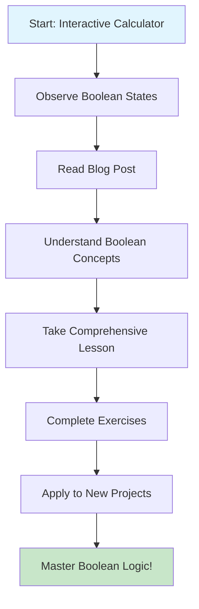

# 🎯 Boolean Logic Learning Journey

Welcome to your comprehensive boolean logic learning experience! This learning path takes you from basic concepts to advanced applications using interactive calculator examples.

## 📚 Learning Sequence

### 1. 🧮 Interactive Calculator Experience
**Start Here**: [Enhanced Calculator with Boolean Monitoring](/calculator)

- Experience boolean logic in action
- Watch real-time boolean state changes
- See how boolean conditions control calculator behavior
- Practice with division operations and error prevention

**Key Learning Points:**
- Boolean variables control program state
- Boolean conditions prevent errors (like division by zero)
- Boolean flags manage user input validation

---

### 2. 📖 Understanding Booleans Blog Post
**Next Step**: [Understanding Booleans Through Calculator Examples](/understanding-booleans-calculator)

- Learn fundamental boolean concepts
- Explore boolean operators (`==`, `!=`, `&&`, `||`, `!`)
- See practical boolean applications in the calculator
- Understand how booleans make programs "smart"

**Key Learning Points:**
- What booleans are and why they matter
- Boolean comparison and logical operators
- Real-world boolean applications

---

### 3. 🎓 Comprehensive Boolean Logic Lesson
**Deep Dive**: [Boolean Logic Lesson - Interactive Programming Fundamentals](/boolean-logic-lesson)

- Master boolean truth tables
- Complete hands-on exercises
- Debug boolean logic errors
- Apply boolean patterns in programming

**Key Learning Points:**
- Boolean algebra and truth tables
- Common boolean programming patterns
- Debugging boolean logic
- Advanced boolean applications

---

## 🎮 Interactive Learning Elements

### Calculator Features
All calculators in this learning path include:
- ✅ **Real-time Boolean Monitoring**: See boolean values change as you interact
- ✅ **Division Operation**: Practice with division and error handling
- ✅ **State Tracking**: Understand how booleans manage calculator state
- ✅ **Error Prevention**: Learn how booleans prevent invalid operations

### Learning Activities
- 🔍 **Boolean State Observation**: Watch how boolean values change
- 🧪 **Logic Experiments**: Test different input sequences
- 🎯 **Prediction Challenges**: Predict boolean outcomes before testing
- 🐛 **Debug Challenges**: Fix intentional boolean logic errors

## 🏆 Learning Objectives Checklist

Track your progress through the boolean logic concepts:

### Foundational Level
- [ ] I can identify boolean values (`true` and `false`)
- [ ] I understand what boolean expressions are
- [ ] I can recognize boolean operators in code

### Application Level  
- [ ] I can use comparison operators (`==`, `!=`, `<`, `>`, etc.)
- [ ] I can combine boolean expressions with logical operators (`&&`, `||`, `!`)
- [ ] I can write simple conditional statements using booleans

### Analysis Level
- [ ] I can trace through boolean logic in existing code
- [ ] I can identify boolean logic errors in programs
- [ ] I can explain how boolean conditions control program flow

### Mastery Level
- [ ] I can design boolean logic solutions for new problems
- [ ] I can implement boolean state management in programs
- [ ] I can optimize boolean expressions for clarity and efficiency

## 🔄 Recommended Learning Flow

## 🚀 Next Steps After Mastery

Once you've mastered boolean logic, explore these advanced topics:

1. **Conditional Statements**: `if/else`, `switch`, ternary operators
2. **Loops**: `while`, `for`, `do-while` with boolean conditions  
3. **Functions**: Boolean parameters and return values
4. **Data Structures**: Boolean flags in arrays and objects
5. **Algorithms**: Search, sort, and optimization using boolean logic

## 💡 Study Tips

### For Visual Learners
- Focus on the real-time boolean state displays
- Draw truth tables for complex expressions
- Use the interactive calculator to visualize concepts

### For Hands-on Learners
- Complete all the coding exercises
- Modify the calculator code to add new features
- Create your own boolean logic examples

### For Reading/Writing Learners
- Take notes on key boolean concepts
- Write explanations of how each boolean operator works
- Create your own boolean logic documentation

## 🤝 Getting Help

If you need assistance with boolean logic concepts:

1. **Review the Examples**: All code includes detailed comments
2. **Use the Interactive Tools**: The calculators show real-time boolean states
3. **Practice with Variations**: Try different input sequences
4. **Ask Questions**: Use the comments section on each page

---

*Ready to start your boolean logic journey? Begin with the [Interactive Calculator](/calculator) and watch boolean logic come to life!*

## 📈 Assessment Rubric

| Level | Criteria | Evidence |
|-------|----------|----------|
| **Novice** | Recognizes boolean values | Can identify `true` and `false` in code |
| **Developing** | Uses basic boolean operators | Writes simple `if` statements with boolean conditions |
| **Proficient** | Combines boolean expressions | Uses `&&`, `\|\|`, `!` operators correctly |
| **Advanced** | Debugs boolean logic | Identifies and fixes boolean logic errors |
| **Expert** | Designs boolean solutions | Creates efficient boolean logic for complex problems |

---

*Happy learning! 🚀 Boolean logic is the foundation of all programming logic - master it and you'll understand how computers make decisions!*
